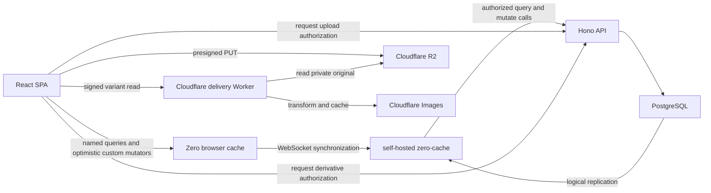
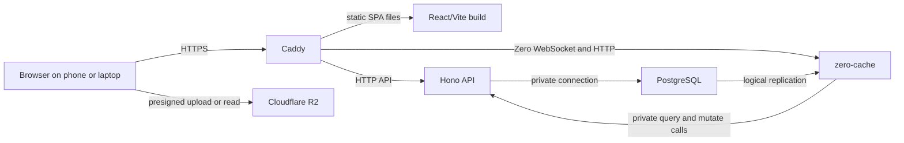

# Architecture

This document describes the current system structure and the boundaries between
its runtimes. See [Security and synchronization](./security-and-sync.md) for
authorization, locking, and synchronization invariants; [Data model](./data-model.md)
for persisted schema details; and [Architecture decisions](./decisions.md) for
the reasoning behind the major choices.

## Chosen stack


| Responsibility                 | Choice                                            |
| ------------------------------ | ------------------------------------------------- |
| Monorepo                       | pnpm workspaces                                   |
| Language                       | TypeScript with strict checking                   |
| Web application                | React with Vite, rendered entirely in the browser |
| Routing                        | TanStack Router                                   |
| Web component library          | Internal package built on Base UI and Tailwind    |
| Future native UI library       | Internal package built on Expo UI                 |
| Runtime validation             | Zod                                               |
| Local data and synchronization | Rocicorp Zero                                     |
| HTTP API                       | Hono running on Node.js                           |
| Authoritative database         | PostgreSQL                                        |
| Database access and migrations | Drizzle ORM with committed SQL migrations         |
| Password hashing               | Argon2id                                          |
| Image storage                  | Cloudflare R2 through its S3-compatible API       |
| Image transformation/delivery  | Cloudflare Images through an authorization Worker |
| TLS and reverse proxy          | Caddy                                             |
| Initial production host        | OVHcloud VPS-1 in Gravelines, Ubuntu 26.04 AMD64  |
| Production process topology    | Docker Compose on one Linux host                  |
| Unit and API testing           | Vitest and focused HTTP/service tests             |
| Formatting and linting         | Biome                                             |


Use current stable package versions when implementation begins and pin the `zero-cache` container to the same compatible Zero major version as the client package.

## Repository shape

```text
home-hub/
├── apps/
│   ├── api/                 Hono application and Zero endpoints
│   └── web/                 React/Vite application and feature composition
│   # mobile/                Reserved for a future Expo/React Native application
├── packages/
│   ├── database/            Drizzle schema, database client, SQL migrations
│   ├── shared/              Zod contracts, domain helpers, Zero schema/queries/mutators
│   └── ui-web/              Base UI-backed React DOM component library
│   # ui-native/             Reserved for the future React Native application
├── docs/
├── package.json
├── pnpm-workspace.yaml
└── tsconfig.base.json
```

Do not introduce a task orchestrator or generic `config`, `domain`, `contracts`,
or `sync` packages. A package should exist only when it has a concrete boundary
and a focused consumer; multiple consumers alone are not a reason to create a
generic abstraction.

## Runtime boundaries




### React application

The browser application owns rendering, forms, navigation, and presentation of connection state. It reads synchronized application data through Zero queries and performs connected optimistic changes through custom Zero mutators.

It does not contain authoritative authorization logic. Disabling a button is user experience, not security.

Reusable React DOM primitives live in `packages/ui-web`; feature-specific web
components remain in `apps/web`. `ui-web` composes the unstyled components from
`@base-ui/react` and owns its CSS-variable tokens and Tailwind integration.

A future `packages/ui-native` implements the same documented design language
and component vocabulary on top of Expo UI. It wraps Expo UI's SwiftUI and
Jetpack Compose components and owns native token values. There is no separate
design-token package. The web and native libraries share documented names and
intent, but their implementations remain platform-specific because DOM and
native styling, interaction, and accessibility behavior are not
interchangeable. Base UI is the web foundation; Expo UI is the native
foundation.

Feature code in `apps/mobile` imports Home Hub components from `ui-native`
rather than importing Expo UI directly. Prefer Expo UI's universal components
for shared controls and its platform-specific components where native
conventions should differ. If Expo UI lacks a simple building block, use an
ordinary React Native component inside `ui-native`; do not add another primitive
library by default. Confirm the exact API and component coverage against the
chosen Expo SDK when native implementation begins, and verify behavior with
VoiceOver and TalkBack.

## Household and module boundaries

The household is the tenancy, collaboration, and authorization boundary. A
user may belong to multiple households, and every household-owned row is
authorized through current membership in PostgreSQL.

Shopping and Recipes are the initial built-in feature modules. French
Vocabulary and possible future features such as household finance use the same
module boundary when implemented. Modules are not dynamically installed
plugins: application code owns a small catalogue of stable module keys.

The stable keys and defaults live in `packages/shared` so the API, web client,
and future mobile client agree on identifiers. Each client owns its own mapping
from an enabled key to platform-specific navigation and screens; the catalogue
does not contain executable plugins or generic feature implementations.

Each household has an enabled setting for every implemented module. The owner
configures that setting for the whole household; there are no per-member module
permissions. Core household selection and management cannot be disabled.
Disabling a module retains its data but blocks its interface and every
server-side access path. A missing setting fails closed. The canonical
enforcement rules are in [Security and synchronization](./security-and-sync.md).

Cross-module behavior is implemented as an explicit application operation. For
example, adding recipe ingredients to the shopping list connects Recipes and
Shopping by copying ingredient names and inserting or reactivating normalized
shopping rows. Both modules must be enabled for that operation. There is no
shared item catalog: each module owns its records, and the explicit operation
is the integration boundary.

### Future mobile application

A future `apps/mobile` can use Expo and React Native without changing the API or database architecture. It will consume the same Zod contracts, domain helpers, Zero schema, named queries, and custom mutators from `packages/shared`. Platform-specific screens, navigation, secure token storage, and native persistence remain inside `apps/mobile`.

Zero supports React Native and Expo directly. Unlike the browser, the native client must provide a key-value store such as Zero's Expo SQLite adapter. Keep `packages/shared` free of browser-only globals so both clients can import it.

### Zero browser client

Zero owns synchronized browser data, reactive queries, optimistic changes, reconciliation, and cached reads. It must be used directly rather than hidden behind a generic repository layer.

Create one Zero client for the authenticated route tree and keep its non-authentication provider options referentially stable. Publish that client through TanStack Router context so route loaders can run the same named queries used by their screens. Route loaders warm Zero's cache; screen components remain reactive through `useQuery`, and Zero owns freshness and query deduplication.

The authenticated application shell owns household and module navigation. It
reactively lists every current membership and each household's enabled modules;
Household settings remains available independently of optional module settings.
The household index route chooses the first enabled module, and each optional
module route redirects only when its completed settings query says that module
is disabled. The shell does not perform global fallback redirects.

There will be no PowerSync, TanStack DB, Redux persistence layer, or custom offline mutation queue.

### `zero-cache`

`zero-cache` is self-hosted. It maintains a local replica of PostgreSQL, materializes requested queries, and sends incremental changes to clients. It calls the API’s query and mutate endpoints so that the API can apply authenticated authorization rules.

PostgreSQL must support logical replication, and the upstream connection must be direct rather than routed through a transaction pooler.

### Hono API

The API owns:

- account authentication, JWT issuance, and refresh-token rotation;
- household selection data, lifecycle, membership, and ownership commands;
- invite creation, acceptance, and revocation;
- owner-authorized household module configuration;
- verification of Zero authentication tokens;
- transformation of named Zero queries using trusted user context;
- transactional execution and authorization of Zero mutations;
- R2 presigned original-upload URLs and signed derivative-delivery capabilities;
- the health endpoint.

The API remains stateless apart from PostgreSQL and R2. Feature dependencies
are grouped by `auth`, `households`, `shopping`, `recipeImages`, and `zero`.
Database access, R2, validated configuration, logging, and the Zero database
provider remain explicit infrastructure dependencies.

Run Hono on Node.js through `@hono/node-server`. Hono's Web-standard request and response objects fit Zero's `handleQueryRequest` and `handleMutateRequest` APIs directly. Keep handlers thin: validation and authentication middleware establish trusted inputs, while transactional service functions enforce business rules and tenancy.

### PostgreSQL

PostgreSQL is the source of truth. Schema changes are represented by reviewable SQL migration files and are never applied automatically during API startup.

Generate migrations with `pnpm db:generate`, inspect the SQL, and apply them
locally with `pnpm db:migrate`. The person building the project generates,
reviews, tests, and commits migrations so persisted-state changes remain
deliberate. CI applies the complete committed migration history to a disposable
PostgreSQL database. After CI succeeds, production deployment creates an
off-host backup and automatically applies pending forward migrations before
starting the new application version. It never automatically reverses a
migration or restores a backup. Destructive or backward-incompatible changes
require an explicit staged migration and rollback plan.

### Cloudflare R2 and Images

Original image bytes travel directly from the browser to private R2 through
short-lived presigned upload URLs. Confirmed originals remain the canonical
source and are not directly readable by users. The API stores only metadata
and never writes uploaded files to its filesystem.

For display, a Cloudflare Worker validates a short-lived capability authorized
by the API, selects one of the code-owned variants, reads the private R2
original, and uses Cloudflare Images to generate and cache the optimized
derivative. Arbitrary client-controlled transformations and original-image
downloads are not exposed.

Recipes-specific URL caching, upload, deletion, and bucket CORS rules are
documented in
[Recipes image storage and security](./recipes/#image-storage-and-security).

## Configuration

Use one root `.env` for local development and commit only `.env.example`. Vite may expose variables prefixed with `VITE_`; all other values remain server-side.

Typical values are:

- `DATABASE_URL`
- `API_PORT`
- `API_JWT_SECRET`
- `SIGNUP_ACCESS_CODE`
- `R2_ENDPOINT`
- `R2_ACCESS_KEY_ID`
- `R2_SECRET_ACCESS_KEY`
- `R2_BUCKET`
- `VITE_ZERO_CACHE_URL`

The initial production target is an OVHcloud VPS-1 in Gravelines running
Ubuntu Server 26.04 LTS on AMD64, with Caddy, the Hono API, `zero-cache`, and
PostgreSQL deployed through Docker Compose. See [Deployment](./deployment.md).
The application is exposed at `https://home.achichorro.com`; Caddy serves the
SPA at the origin and routes `/api/*` and `/zero/*` to their private services.

## Production topology



Caddy is the only public application entry point. It terminates HTTPS, serves
the compiled SPA with an `index.html` fallback, and reverse-proxies API and
Zero traffic. PostgreSQL and the containers' direct API and Zero ports remain
private to the Compose network.

The public API uses the `/api` prefix, keeping API requests distinct from SPA
routes such as `/households/:householdId/shopping`. Production routing must
preserve that boundary and the SPA's `index.html` fallback. Changes to the API
prefix must be made together with the `/api/auth` refresh-cookie path and the
Zero query and mutation callback URLs. The deployed browser and API share one
origin, so the application API does not require CORS. Direct browser-to-R2
transfers are cross-origin and require the restricted R2 bucket CORS policy
described above.
