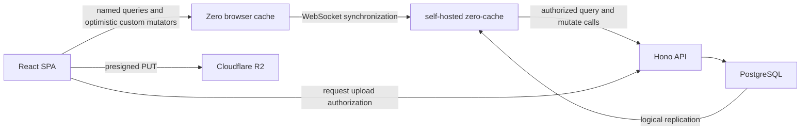

# Architecture

## Chosen stack


| Responsibility                 | Choice                                            |
| ------------------------------ | ------------------------------------------------- |
| Monorepo                       | pnpm workspaces                                   |
| Language                       | TypeScript with strict checking                   |
| Web application                | React with Vite, rendered entirely in the browser |
| Routing                        | TanStack Router                                   |
| Basic styling                  | Tailwind CSS                                      |
| Runtime validation             | Zod                                               |
| Local data and synchronization | Rocicorp Zero                                     |
| HTTP API                       | Hono running on Node.js                           |
| Authoritative database         | PostgreSQL                                        |
| Database access and migrations | Drizzle ORM with committed SQL migrations         |
| Password hashing               | Argon2id                                          |
| Image storage                  | Cloudflare R2 through its S3-compatible API       |
| Unit and API testing           | Vitest and focused HTTP/service tests             |
| Formatting and linting         | Biome                                             |


Use current stable package versions when implementation begins and pin the `zero-cache` container to the same compatible Zero major version as the client package.

## Repository shape

```text
home-hub/
├── apps/
│   ├── api/                 Hono application and Zero endpoints
│   └── web/                 React/Vite application
│   # mobile/                Reserved for a future Expo/React Native application
├── packages/
│   ├── database/            Drizzle schema, database client, SQL migrations
│   └── shared/              Zod contracts, domain helpers, Zero schema/queries/mutators
├── docs/
├── package.json
├── pnpm-workspace.yaml
└── tsconfig.base.json
```

Do not introduce a task orchestrator or generic `config`, `domain`, `contracts`, or `sync` packages. A package should exist only when it has a real boundary and multiple consumers.

## Runtime boundaries




### React application

The browser application owns rendering, forms, navigation, and presentation of connection state. It reads synchronized application data through Zero queries and performs connected optimistic changes through custom Zero mutators.

It does not contain authoritative authorization logic. Disabling a button is user experience, not security.

### Future mobile application

A future `apps/mobile` can use Expo and React Native without changing the API or database architecture. It will consume the same Zod contracts, domain helpers, Zero schema, named queries, and custom mutators from `packages/shared`. Platform-specific screens, navigation, secure token storage, and native persistence remain inside `apps/mobile`.

Zero supports React Native and Expo directly. Unlike the browser, the native client must provide a key-value store such as Zero's Expo SQLite adapter. Keep `packages/shared` free of browser-only globals so both clients can import it.

### Zero browser client

Zero owns synchronized browser data, reactive queries, optimistic changes, reconciliation, and cached reads. It must be used directly rather than hidden behind a generic repository layer.

There will be no PowerSync, TanStack DB, Redux persistence layer, or custom offline mutation queue.

### `zero-cache`

`zero-cache` is self-hosted. It maintains a local replica of PostgreSQL, materializes requested queries, and sends incremental changes to clients. It calls the API’s query and mutate endpoints so that the API can apply authenticated authorization rules.

PostgreSQL must support logical replication, and the upstream connection must be direct rather than routed through a transaction pooler.

### Hono API

The API owns:

- account authentication, JWT issuance, and refresh-token rotation;
- household and membership commands;
- invite creation and acceptance;
- verification of Zero authentication tokens;
- transformation of named Zero queries using trusted user context;
- transactional execution and authorization of Zero mutations;
- R2 presigned upload and read URLs;
- health and readiness endpoints.

The API remains stateless apart from PostgreSQL and R2.

Run Hono on Node.js through `@hono/node-server`. Hono's Web-standard request and response objects fit Zero's `handleQueryRequest` and `handleMutateRequest` APIs directly. Keep handlers thin: validation and authentication middleware establish trusted inputs, while transactional service functions enforce business rules and tenancy.

### PostgreSQL

PostgreSQL is the source of truth. Schema changes are represented by reviewable SQL migration files and are never applied automatically during API startup.

### Cloudflare R2

Image bytes travel directly between the browser and R2 through short-lived presigned URLs. The API stores only metadata and never writes uploaded files to its filesystem.

## Configuration

Use one root `.env` for local development and commit only `.env.example`. Vite may expose variables prefixed with `VITE_`; all other values remain server-side.

Typical values are:

- `DATABASE_URL`
- `ZERO_JWT_SECRET`
- `WEB_ORIGIN`
- `PORT`
- `R2_ENDPOINT`
- `R2_ACCESS_KEY_ID`
- `R2_SECRET_ACCESS_KEY`
- `R2_BUCKET`
- `VITE_ZERO_CACHE_URL`

Production deployment is intentionally deferred. A development Compose file for PostgreSQL and a single-node `zero-cache` is appropriate.

## Application-shell caching

Do not add a service worker at the beginning. First prove that Zero retains synchronized reads after a normal reload. If an installable/offline-loading application shell is still desired, add `vite-plugin-pwa` later and cache only compiled static assets—not API responses or authenticated data.
