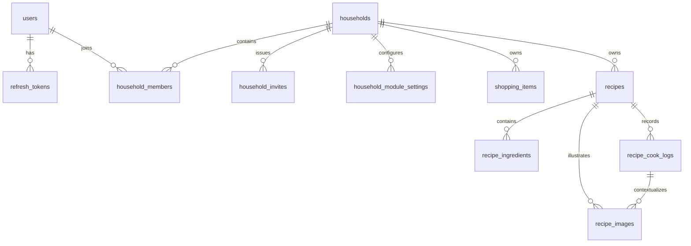

# Data model

This document owns persisted entities, columns, relationships, constraints,
and schema-level invariants. Authorization, transaction locking, and
synchronization rules are defined in
[Security and synchronization](./security-and-sync.md).

## General rules

- Generate UUIDv4 identifiers in the client for rows created optimistically.
  Use the platform cryptographic UUID generator rather than adding an ID
  library solely for time ordering; explicit timestamps determine display
  order.
- Store timestamps in UTC using PostgreSQL `timestamptz`.
- Give every synchronized household-owned row a direct `household_id`, even when it is reachable through another foreign key.
- Enforce invariants in PostgreSQL as well as in application code.
- Do not migrate legacy data; this is a fresh data model.

## Entity relationships

## Tables

### `users`

- `id`
- `username`: normalized, unique
- `email`: normalized, unique
- `password_hash`
- `created_at`, `updated_at`

Username and email normalization happen before uniqueness checks. Username normalization uses trimming, Unicode NFKC normalization, whitespace folding, and case folding. Email normalization initially uses trimming, Unicode NFKC normalization, and case folding.

### `refresh_tokens`

- `id`
- `token_hash`: SHA-256 hash of an opaque random refresh token, unique
- `user_id`
- `expires_at`
- `revoked_at`, nullable
- `replaced_by_id`, nullable self-reference to `refresh_tokens.id`
- `created_at`, `updated_at`

The raw refresh token is never stored. Short-lived access JWTs are not stored as rows; they expire naturally. Each signup or login starts an independent forward-linked refresh-token chain. Replacements inherit the initial token's expiry. These rows provide rotation, reuse detection, current-session logout, and password-change invalidation.

### `households`

- `id`
- `name`
- `created_at`, `updated_at`

Household names are trimmed display labels of 1–100 characters and do not need
to be unique.

### `household_members`

- `id`
- `household_id`
- `user_id`
- `role`: `owner | member`
- `created_at`, `updated_at`

Use `id` as the primary key and enforce a unique household/user pair.

Each household has exactly one owner. Enforce at most one owner with a partial
unique index on `household_id` for rows whose role is `owner`; household
creation and ownership-transfer operations must transactionally ensure
that an owner always exists.

Ownership may transfer only to another membership in the same household. The
transaction demotes the current owner and promotes the target member before it
commits. Members may leave and the owner may remove members, but the current
owner membership cannot be removed directly.

### `household_invites`

- `id`
- `household_id`
- `creator_id`
- `token_hash`
- `expires_at`
- `accepted_at`, nullable
- `revoked_at`, nullable
- `created_at`, `updated_at`

Invite tokens are opaque, stored only as hashes, single-use, and expiring. Only
the owner may create them. Initial invites expire after seven days and may be
accepted only by an authenticated user. An existing member cannot consume an
invite. An owner may revoke an unaccepted invitation by setting `revoked_at`.

Enforce a unique `token_hash` and index `household_id`. Invite acceptance locks
the invite and transactionally creates a `member` membership while setting
`accepted_at`.

### `household_module_settings`

- `household_id`
- `module_key`: stable code-owned module identifier
- `enabled`
- `created_at`, `updated_at`

Use `(household_id, module_key)` as the primary key. There is no database-backed
plugin registry: `packages/shared` defines the supported keys and defaults, and
each module addition includes an explicit migration. Household creation inserts
a setting for every implemented module. A new module migration backfills every
existing household with its chosen default; missing settings fail closed.

Lists and Recipes are initially enabled. Deferred modules such as French
Vocabulary default to disabled. Disabling a module retains all of its rows.
Core household and membership behavior has no module setting and cannot be
disabled.

### Lists module tables

Lists owns `lists` and `list_items`. Their columns, normalization, uniqueness,
ordering, and status-transition rules are documented in the
[Lists module data model](./lists/#data-model). The retired `shopping_items`
table remains temporarily for the staged migration.

### Recipes module tables

Recipes owns `recipes`, `recipe_ingredients`, `recipe_cook_logs`, and
`recipe_images`. Their columns, constraints, normalization, ordering, and image
metadata lifecycle are documented in the
[Recipes module data model](./recipes/#data-model).

## Schema invariants

- A household has at most one owner row; application transactions ensure it
  always has exactly one owner.
- A user has at most one membership in a household.
- List names are unique within a household; item names are unique within a list.
  Item references cannot cross households; see the [Lists data model](./lists/#data-model).
- Recipes references cannot cross household or recipe boundaries; see the
  [Recipes module data model](./recipes/#data-model).
- Module settings are unique by household and stable module key.

The transactions that preserve these invariants, including their explicit
locking requirements, are documented in
[Security and synchronization](./security-and-sync.md).
