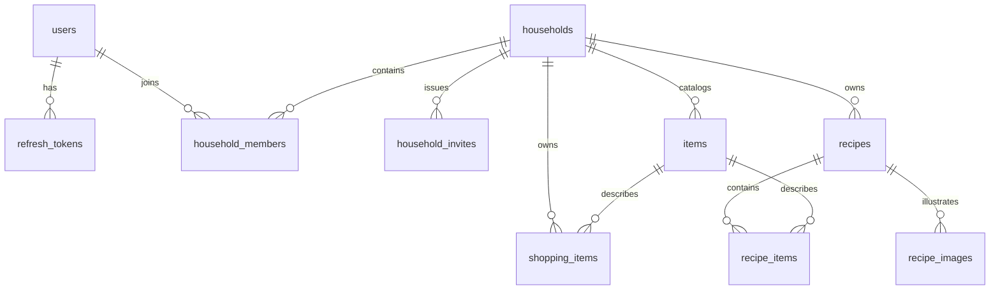

# Data model

## General rules

- Generate UUIDv7 identifiers in the client for rows created optimistically.
- Store timestamps in UTC using PostgreSQL `timestamptz`.
- Give every synchronized household-owned row a direct `household_id`, even when it is reachable through another foreign key.
- Use independent IDs for recipe ingredient and image rows so concurrent edits address stable records.
- Enforce invariants in PostgreSQL as well as in application code.
- Do not migrate legacy data; this is a fresh data model.

## Entity relationships

## Tables

### `users`

- `id`
- `username`: normalized, unique
- `email`: normalized, unique
- `password_hash`
- `created_at`, `updated_at`

Username and email normalization happen before uniqueness checks. Username normalization uses trimming, Unicode NFKC normalization, whitespace folding, and case folding. Email normalization initially uses trimming, Unicode NFKC normalization, and case folding.

### `refresh_tokens`

- `id`
- `token_hash`: SHA-256 hash of an opaque random refresh token, unique
- `user_id`
- `expires_at`
- `revoked_at`, nullable
- `replaced_by_id`, nullable
- `created_at`, `updated_at`

The raw refresh token is never stored. Short-lived access JWTs are not stored as rows; they expire naturally. Refresh-token rows provide revocation, reuse detection, logout, and password-change invalidation.

### `households`

- `id`
- `name`
- `created_at`, `updated_at`

### `household_members`

- `id`
- `household_id`
- `user_id`
- `role`: `owner | member`
- `created_at`, `updated_at`

Enforce a unique household/user pair.

### `household_invites`

- `id`
- `household_id`
- `creator_id`
- `token_hash`
- `expires_at`
- `accepted_at`, nullable
- `revoked_at`, nullable
- `created_at`, `updated_at`

Invite tokens are opaque, stored only as hashes, single-use, expiring, and revocable.

### `items`

- `id`
- `household_id`
- `name`
- `normalized_name`
- `kind`: `ingredient | non_ingredient`
- `created_at`, `updated_at`

Normalize item names with trimming, Unicode NFKC normalization, whitespace folding, and case folding. Enforce uniqueness on `(household_id, normalized_name)`.

### `shopping_items`

- `id`
- `household_id`
- `item_id`
- `status`: `active | crossed | archived`
- `created_at`, `updated_at`

Use explicit status transitions rather than deletion for normal shopping-list behavior.

### `recipes`

- `id`
- `household_id`
- `title`
- `description`
- `created_at`, `updated_at`

### `recipe_items`

- `id`
- `household_id`
- `recipe_id`
- `item_id`
- `quantity`: text
- `unit`: text
- `note`: text
- `position`: integer
- `created_at`, `updated_at`

Quantity remains text so values such as `½`, `2–3`, and `to taste` are representable.

### `recipe_images`

- `id`
- `household_id`
- `recipe_id`
- `object_key`
- `content_type`
- `position`: integer
- `created_at`, `updated_at`

Object keys are server-controlled and independent of public hostnames.

## Transactional invariants

- Creating a household and its owner membership is one transaction.
- Accepting an invite and creating membership is one transaction.
- Every household operation checks membership inside the same transaction as its write.
- A shopping row may reference only an item from the same household.
- A recipe ingredient may reference only a recipe and item from the same household.
- Recipe image metadata may reference only a recipe from the same household.
- Concurrent duplicate item names must resolve through the normalized-name constraint with an explicit error or a deliberate canonical-row remapping strategy.
