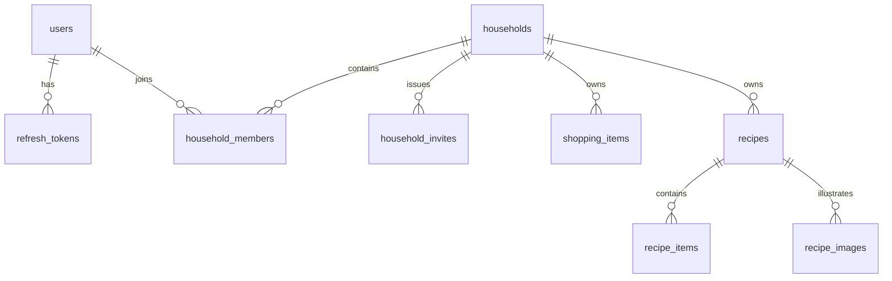

# Data model

## General rules

- Generate UUIDv7 identifiers in the client for rows created optimistically.
- Store timestamps in UTC using PostgreSQL `timestamptz`.
- Give every synchronized household-owned row a direct `household_id`, even when it is reachable through another foreign key.
- Use independent IDs for recipe ingredient and image rows so concurrent edits address stable records.
- Enforce invariants in PostgreSQL as well as in application code.
- Do not migrate legacy data; this is a fresh data model.

## Entity relationships

## Tables

### `users`

- `id`
- `username`: normalized, unique
- `email`: normalized, unique
- `password_hash`
- `created_at`, `updated_at`

Username and email normalization happen before uniqueness checks. Username normalization uses trimming, Unicode NFKC normalization, whitespace folding, and case folding. Email normalization initially uses trimming, Unicode NFKC normalization, and case folding.

### `refresh_tokens`

- `id`
- `token_hash`: SHA-256 hash of an opaque random refresh token, unique
- `user_id`
- `expires_at`
- `revoked_at`, nullable
- `replaced_by_id`, nullable self-reference to `refresh_tokens.id`
- `created_at`, `updated_at`

The raw refresh token is never stored. Short-lived access JWTs are not stored as rows; they expire naturally. Each signup or login starts an independent forward-linked refresh-token chain. Replacements inherit the initial token's expiry. These rows provide rotation, reuse detection, current-session logout, and password-change invalidation.

### `households`

- `id`
- `name`
- `created_at`, `updated_at`

Household names are trimmed display labels of 1–100 characters and do not need
to be unique.

### `household_members`

- `id`
- `household_id`
- `user_id`
- `role`: `owner | member`
- `created_at`, `updated_at`

Use `id` as the primary key and enforce a unique household/user pair.

Each household has exactly one owner. Enforce at most one owner with a partial
unique index on `household_id` for rows whose role is `owner`; household
creation and future ownership-transfer operations must transactionally ensure
that an owner always exists.

### `household_invites`

- `id`
- `household_id`
- `creator_id`
- `token_hash`
- `expires_at`
- `accepted_at`, nullable
- `revoked_at`, nullable
- `created_at`, `updated_at`

Invite tokens are opaque, stored only as hashes, single-use, and expiring. Only
the owner may create them. Initial invites expire after seven days and may be
accepted only by an authenticated user. An existing member cannot consume an
invite. `revoked_at` is reserved for a future revocation feature; no initial
operation sets it.

Enforce a unique `token_hash` and index `household_id`. Invite acceptance locks
the invite and transactionally creates a `member` membership while setting
`accepted_at`.

### `shopping_items`

- `id`
- `household_id`
- `name`
- `normalized_name`
- `status`: `active | crossed | archived`
- `created_at`, `updated_at`

Store `name` as a display value after Unicode NFKC normalization, whitespace
folding, and trimming while preserving casing. It must contain 1–100
characters after cleaning. Derive `normalized_name` from that display value by
lowercasing it, and enforce uniqueness on
`(household_id, normalized_name)`.

Use explicit status transitions rather than deletion for normal shopping-list
behavior. Any status may be changed to any other valid status; setting the
current status again is an idempotent no-op. Re-adding a crossed or archived
name reactivates the existing row rather than inserting a duplicate.

### `recipes`

- `id`
- `household_id`
- `title`
- `description`
- `created_at`, `updated_at`

### `recipe_items`

- `id`
- `household_id`
- `recipe_id`
- `name`
- `quantity`: text
- `unit`: text
- `note`: text
- `position`: integer
- `created_at`, `updated_at`

Quantity remains text so values such as `½`, `2–3`, and `to taste` are representable.

### `recipe_images`

- `id`
- `household_id`
- `recipe_id`
- `object_key`
- `content_type`
- `position`: integer
- `created_at`, `updated_at`

Object keys are server-controlled and independent of public hostnames.

## Transactional invariants

- Creating a household and its owner membership is one transaction.
- A household has exactly one owner.
- Accepting an invite and creating membership is one transaction.
- Every household operation checks membership inside the same transaction as its write.
- Concurrent duplicate shopping-item names resolve through the normalized-name
  constraint; adding an existing name deliberately reactivates its canonical
  shopping row.
- A recipe ingredient may reference only a recipe from the same household.
- Adding recipe ingredients to Shopping verifies household access and
  inserts or reactivates the normalized shopping rows in one transaction.
- Recipe image metadata may reference only a recipe from the same household.
